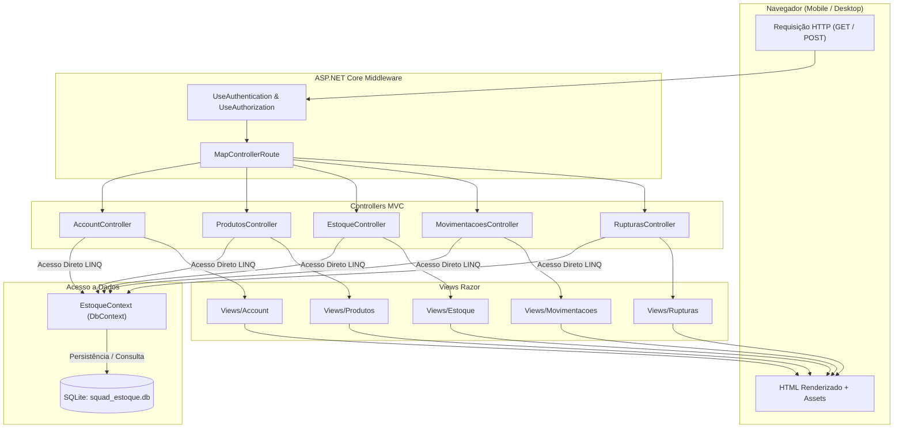

# Documento de Arquitetura de Software — SQUAD

> **Projeto:** Sistema de Controle de Estoque para Varejo de Calçados (SQUAD)  
> **Base Estrutural / Esqueleto:** `SquadEstoque.Web` (ASP.NET Core MVC oficial)  
> **Pilha Tecnológica:** C#, .NET 10, ASP.NET Core MVC, Entity Framework Core, SQLite, Razor Views  

---

## 1. Visão Geral e Princípio Arquitetural

### 1.1 Contexto e Objetivo
O sistema SQUAD é uma ferramenta focada em resolver o problema de chão de loja no varejo de calçados (consulta rápida de estoque pelo vendedor e rastreamento estruturado de rupturas para o lojista).

O projeto **não é construído do zero**. Ele aproveita o projeto `SquadEstoque.Web` como esqueleto e base arquitetural, substituindo integralmente o domínio de *Filmes* pelo domínio de *Estoque de Calçados*.

### 1.2 Princípio de Projeto
> **"Reaproveitar o esqueleto existente e substituir o domínio, não reconstruir o sistema usando uma arquitetura nova."**

A arquitetura é deliberadamente simples, direta e adequada para uma equipe enxuta de quatro desenvolvedores, evitando complexidade acidental ou camadas desnecessárias.

---

## 2. Regras de Contenção Arquitetural

As seguintes restrições regem o desenvolvimento deste projeto:

1. **Padrão Arquitetural**: MVC Tradicional do ASP.NET Core. Não substituir por outras arquiteturas (SPA, Microserviços, Clean Architecture, CQRS, Hexagonal).
2. **Sem Camadas Artificiais**: NÃO criar camadas `Application`, `Domain`, `Infrastructure` ou `Services` sem necessidade concreta e justificada.
3. **Sem Padrões Redundantes**: NÃO introduzir *Repository Pattern* ou *Unit of Work* sobre o Entity Framework Core (o `DbContext` e os `DbSet` já desempenham esses papéis).
4. **Sem DTOs e Interfaces sem Necessidade**: Os Controllers comunicam-se diretamente com o `EstoqueContext` e com as Views através dos Models e ViewModels mínimos necessários para agregação de tela.
5. **Banco de Dados Único**: O banco de dados definido para desenvolvimento e execução é o **SQLite**. Não há previsão de suporte ou migração para PostgreSQL.

---

## 3. Pilha Tecnológica (Tech Stack)

```
┌─────────────────────────────────────────────────────────────┐
│                       SQUAD ESTOQUE                         │
├──────────────────────────────┬──────────────────────────────┤
│ Plataforma & Linguagem       │ .NET 10 / C#                 │
│ Padrão Web                   │ ASP.NET Core MVC             │
│ Motor de Apresentação        │ Razor Views (.cshtml)        │
│ Mapeamento Objeto-Relacional │ Entity Framework Core 10     │
│ Banco de Dados               │ SQLite 3.x (arquivo local)   │
│ Client-side / UI             │ Bootstrap 5, jQuery Validate │
└──────────────────────────────┴──────────────────────────────┘
```

---

## 4. Estrutura de Diretórios e Componentes

A organização do projeto mantém o layout canônico do ASP.NET Core MVC:

```text
src/SquadEstoque.Web/
├── Controllers/
│   ├── AccountController.cs       # Login, Logout e controle de acesso
│   ├── ProdutosController.cs      # Catálogo de modelos e definição de grades
│   ├── EstoqueController.cs       # Consulta rápida (vendedor), entradas e ajustes (lojista)
│   ├── MovimentacoesController.cs # Histórico e auditoria de entradas, saídas e ajustes
│   └── RupturasController.cs      # Relatório e histórico de demandas não atendidas ("Não tinha")
├── Models/
│   ├── Usuario.cs                 # Usuário autenticado e enum PerfilUsuario (VENDEDOR, LOJISTA)
│   ├── Produto.cs                 # Modelo comercial de calçado
│   ├── Sku.cs                     # Unidade mínima de estoque (Produto + Numeração)
│   ├── Movimentacao.cs            # Registro imutável de movimentação e enum TipoMovimentacao
│   ├── Ruptura.cs                 # Registro de demanda não atendida vinculada a SKU
│   └── ErrorViewModel.cs          # Modelo padrão para exibição de erros
├── Views/
│   ├── Account/                   # Telas de Login e Acesso Negado
│   ├── Produtos/                  # Telas de listagem e cadastro de modelos
│   ├── Estoque/                   # Consulta de grade (vendedor) e telas de entrada/ajuste (lojista)
│   ├── Movimentacoes/             # Listagem do livro-razão de movimentações
│   ├── Rupturas/                  # Visão consolidada de perdas de venda
│   ├── Shared/                    # _Layout.cshtml, _ValidationScriptsPartial.cshtml, Error.cshtml
│   ├── _ViewImports.cshtml        # Importação global de TagHelpers e namespaces
│   └── _ViewStart.cshtml          # Layout padrão
├── Data/
│   └── EstoqueContext.cs          # DbContext do EF Core com mapeamento das 5 tabelas
├── Migrations/                    # Migrações gerenciadas pelo EF Core
├── wwwroot/                       # Arquivos estáticos (CSS, JS, Bootstrap, jQuery)
├── Program.cs                     # Configuração de serviços, autenticação e pipeline HTTP
├── appsettings.json               # Connection string do SQLite e configurações
└── squad_estoque.db               # Base física de dados SQLite
```

---

## 5. Fluxo de Execução da Aplicação



---

## 6. Decisões Arquiteturais

### 6.1 Decisões Já Definidas e Aprovadas

| ID | Tópico | Decisão Aprovada | Justificativa |
| :--- | :--- | :--- | :--- |
| **DA-01** | **Esqueleto do Projeto** | O projeto `SquadEstoque.Web` é a base estrutural e tecnológica direta. | Aproveitamento do scaffolding, tooling e configuração já existente e testada. |
| **DA-02** | **SGBD** | **SQLite 3.x** via provedor oficial do EF Core (`Microsoft.EntityFrameworkCore.Sqlite`). | Simplicidade operacional, sem dependência de servidor de banco externo para o MVP. |
| **DA-03** | **Padrão Arquitetural** | **ASP.NET Core MVC tradicional**. | Os controllers acessam o `EstoqueContext` diretamente, sem camadas intermediárias de serviços ou repositórios. |
| **DA-04** | **Unidade Mínima de Estoque (RN-01)** | `Sku` composto por `ProdutoId` + `Numeracao` com constraint única no banco. | Atende estritamente à regra de negócio do varejo de calçados. |
| **DA-05** | **Imutabilidade Operacional (RN-03)** | A tabela `movimentacao` não possui rotas nem lógica de `UPDATE` ou `DELETE`. | Auditoria permanente de entradas, saídas e ajustes de saldo. |
| **DA-06** | **Desacoplamento de Ruptura (RN-05, RN-06)** | A tabela `ruptura` não armazena saldo nem quantidade, sendo gerada exclusivamente pelo clique em "Não tinha". | Ruptura é dado de inteligência comercial, não afeta estoque físico. |
| **DA-07** | **Atomicidade de Venda (RN-07)** | Operações de saída executadas em transação de escrita imediata no SQLite com `CHECK (saldo_atual >= 0)`. | Garante que dois vendedores concorrentes não vendam o último par simultaneamente. |
| **DA-08** | **Autenticação e Sessão** | Cookie Authentication nativo do ASP.NET Core com perfis `VENDEDOR` e `LOJISTA`. | Leve, integrado ao framework e sem a sobrecarga de tabelas do Identity completo. |

---

### 6.2 Decisões Arquiteturais Pendentes (A Serem Alinhadas com a Equipe)

| ID | Tópico | Opções em Aberto | Impacto |
| :--- | :--- | :--- | :--- |
| **DP-01** | **Algoritmo / Pacote de Hash de Senha** | - Opção A: `BCrypt.Net-Next` (atende estritamente o RNF-04 que cita bcrypt custo $\ge 12$).<br>- Opção B: `PasswordHasher<T>` nativo do ASP.NET Core (usa PBKDF2). | Definição da dependência externa no `.csproj`. |
| **DP-02** | **Estratégia de Seed de Dados** | - Opção A: Criar usuários (`vendedor@loja.com` e `lojista@loja.com`) e produtos padrão automaticamente na inicialização caso a base esteja vazia.<br>- Opção B: Não realizar carga inicial automática. | Facilidade de testes manuais e homologação local. |
| **DP-03** | **Estratégia de Migrações do EF Core** | - Opção A: Resetar histórico de migrações de filmes e gerar migração inicial única `InitialSquadSchema`.<br>- Opção B: Adicionar nova migração incremental sobre o schema de filmes. | Limpeza do histórico de migrations do EF Core. |

---
