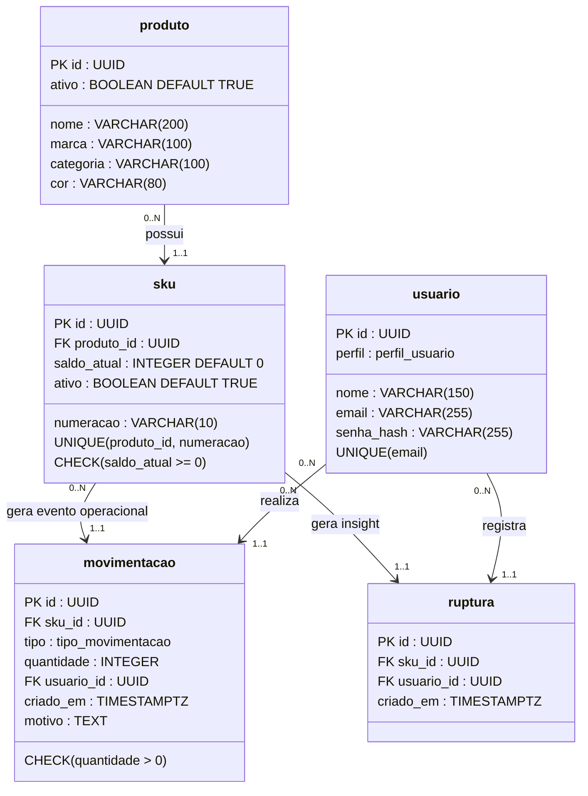

## Diagrama de Classes - Sistema SQUAD

---

## Legenda do Diagrama de Classes

### Tipos de Relacionamento

| Símbolo | Significado |
|----------|-------------|
| --> | Associação navegável |
| 0..1 | Zero ou uma instância |
| 1..1 | Exatamente uma instância |
| 0..N | Zero ou muitas instâncias |
| 1..N | Uma ou muitas instâncias |

### Estereótipos e Atributos

| Notação | Significado |
|----------|-------------|
| PK | Chave Primária |
| FK | Chave Estrangeira |
| UUID | Identificador único |
| ENUM | Tipo enumerado |
| VARCHAR | Texto |
| INTEGER | Número inteiro |
| BOOLEAN | Valor lógico |
| TIMESTAMPTZ | Data e hora com fuso |
| UNIQUE | Restrição de unicidade |
| CHECK | Restrição de validação |

### Multiplicidades Utilizadas no Projeto

| Relacionamento | Interpretação |
|---------------|---------------|
| PRODUTO (0..N) → SKU (1..1) | Um produto pode possuir nenhum ou vários SKUs; todo SKU pertence a exatamente um produto. |
| SKU (0..N) → MOVIMENTACAO (1..1) | Um SKU pode possuir nenhuma ou várias movimentações; toda movimentação pertence a exatamente um SKU. |
| USUARIO (0..N) → MOVIMENTACAO (1..1) | Um usuário pode realizar nenhuma ou várias movimentações; toda movimentação possui exatamente um responsável. |
| SKU (0..N) → RUPTURA (1..1) | Um SKU pode possuir nenhum ou vários registros de ruptura; toda ruptura refere-se a exatamente um SKU. |
| USUARIO (0..N) → RUPTURA (1..1) | Um usuário pode registrar nenhuma ou várias rupturas; toda ruptura possui exatamente um responsável. |

## Responsabilidades das Classes

| Classe | Responsabilidade |
|----------|------------------|
| Usuario | Representar usuários autenticados do sistema, classificados como VENDEDOR ou LOJISTA. |
| Produto | Representar o modelo comercializado pela loja. |
| SKU | Representar a menor unidade controlada pelo estoque (Produto + Numeração). |
| Movimentacao | Registrar alterações de saldo de estoque. |
| Ruptura | Registrar demandas não atendidas durante o atendimento ao cliente. |

---

## Regras de Negócio Associadas

| Classe | Regras |
|----------|---------|
| Usuario | RN-04 — Apenas LOJISTA pode realizar ajustes de estoque. |
| Produto | Serve como agrupador comercial dos SKUs. |
| SKU | RN-01 — Produto + Numeração devem ser únicos. RN-02 — Saldo nunca pode ser negativo. |
| Movimentacao | RN-03 — Registros são imutáveis. RN-07 — Operações de saída devem ser atômicas. |
| Ruptura | RN-05 — Registrada apenas quando o vendedor informa "Não tinha". RN-06 — Deve estar vinculada a um SKU válido. |
