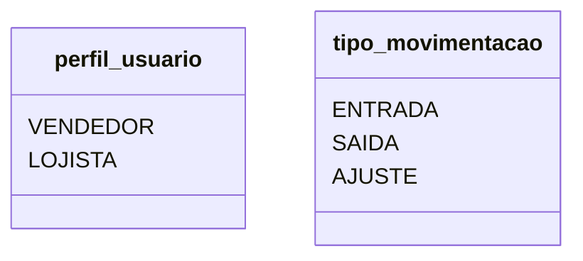
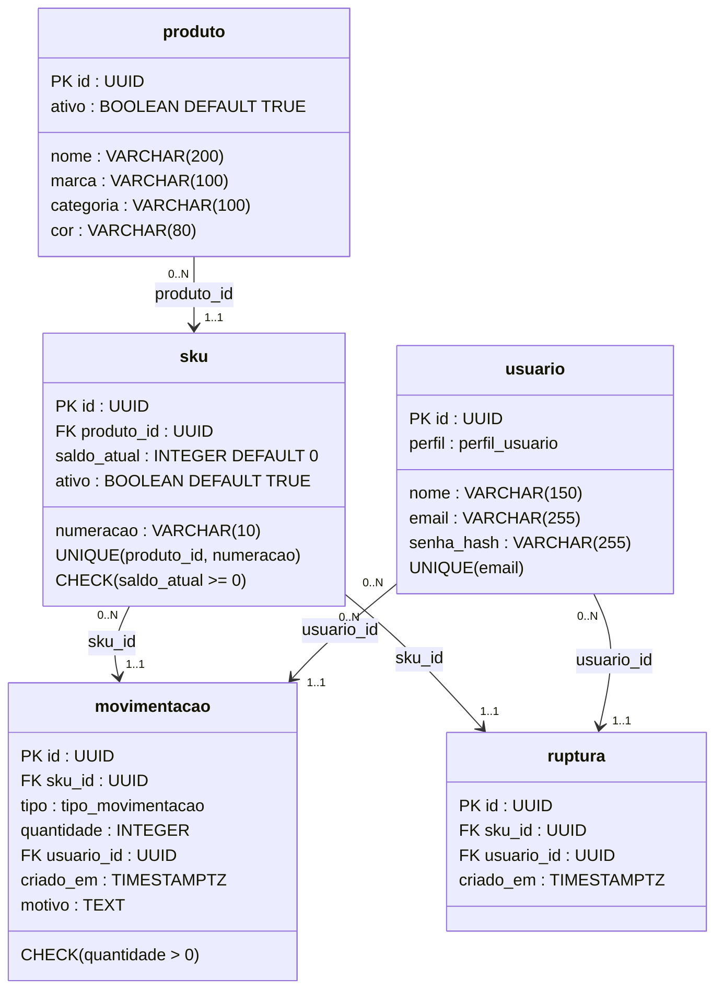

# DER Modelo Físico 

Foco: A implementação técnica e o armazenamento real dos dados.
Componentes: Define os tipos exatos de dados (VARCHAR, INT, DATE), restrições (constraints), índices e o tamanho de cada campo. 

### Legenda
| Notação     | Significado            |
| ----------- | ---------------------- |
| PK          | Primary Key            |
| FK          | Foreign Key            |
| UNIQUE      | Valor único            |
| CHECK       | Restrição de validação |
| NOT NULL    | Campo obrigatório      |
| DEFAULT     | Valor padrão           |
| UUID        | Identificador único    |
| VARCHAR     | Texto com limite       |
| INTEGER     | Número inteiro         |
| BOOLEAN     | Verdadeiro/Falso       |
| TIMESTAMPTZ | Data/Hora com timezone |
| ENUM        | Tipo enumerado         |

## ENUMs do Sistema






### Relacionamentos Físicos

| Tabela Origem | Tabela Destino | FK         | Participação                         |
| ------------- | -------------- | ---------- | ------------------------------------ |
| produto       | sku            | produto_id | PRODUTO (0..N) → SKU (1..1)          |
| sku           | movimentacao   | sku_id     | SKU (0..N) → MOVIMENTACAO (1..1)     |
| usuario       | movimentacao   | usuario_id | USUARIO (0..N) → MOVIMENTACAO (1..1) |
| sku           | ruptura        | sku_id     | SKU (0..N) → RUPTURA (1..1)          |
| usuario       | ruptura        | usuario_id | USUARIO (0..N) → RUPTURA (1..1)      |

```
```


### Legenda de Cardinalidade

| Notação | Significado    |
| ------- | -------------- |
| 0..1    | Zero ou um     |
| 1..1    | Exatamente um  |
| 0..N    | Zero ou muitos |
| 1..N    | Um ou muitos   |

### Constraints Aplicadas
| Tabela       | Constraint                    | Objetivo                    |
| ------------ | ----------------------------- | --------------------------- |
| usuario      | UNIQUE(email)                 | impedir e-mails duplicados  |
| sku          | UNIQUE(produto_id, numeracao) | impedir SKU duplicado       |
| sku          | CHECK(saldo_atual >= 0)       | impedir saldo negativo      |
| movimentacao | CHECK(quantidade > 0)         | impedir quantidade inválida |

### Regras Físicas 
| Regra | Implementação Física                       |
| ----- | ------------------------------------------ |
| RN-01 | UNIQUE(produto_id, numeracao)              |
| RN-02 | CHECK(saldo_atual >= 0)                    |
| RN-03 | ausência de UPDATE/DELETE em movimentacao  |
| RN-04 | validado pela aplicação via perfil_usuario |
| RN-05 | ruptura não possui saldo                   |
| RN-06 | sku_id obrigatório em ruptura              |

