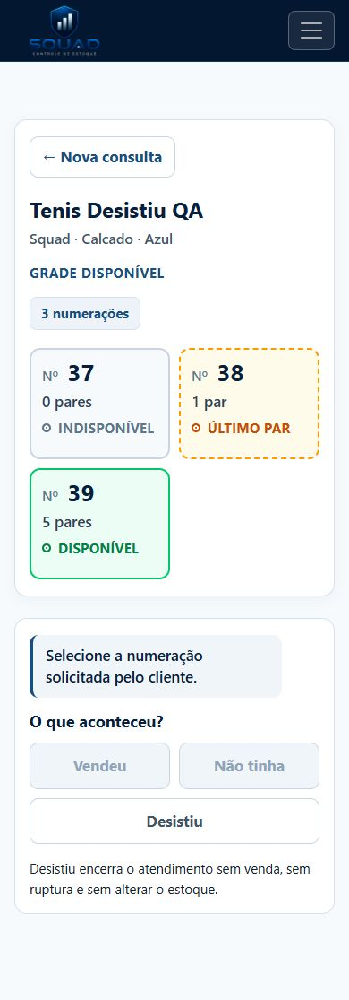
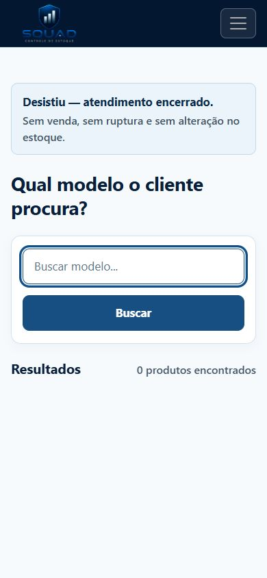
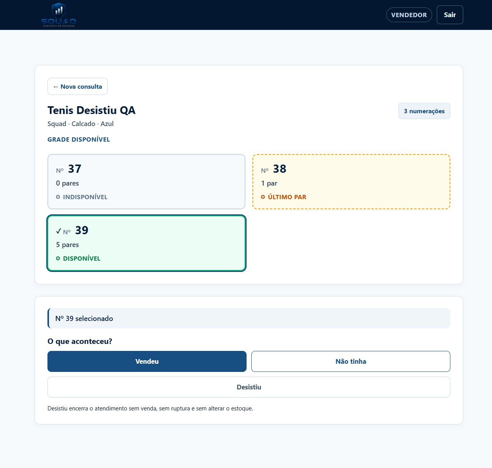
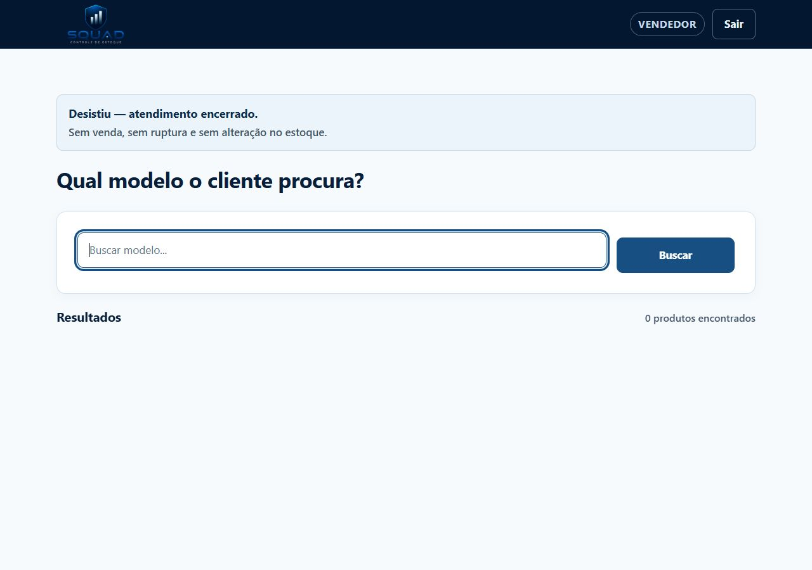

# S2-FE-030 — Desistiu e nova consulta

Requisitos: RF-16, RF-19, US-06 e UC-06. Dependência: PR #43 (S2-BE-029).

Desistiu permanece disponível no contexto do produto, inclusive sem SKU selecionado
ou sem numerações ativas. Após confirmação real do endpoint, a interface carrega a
consulta vazia, preserva o cabeçalho/autenticação e mostra: “Desistiu — atendimento
encerrado. Sem venda, sem ruptura e sem alteração no estoque.” O foco vai para Produto.
Nenhum saldo é calculado e nenhuma persistência é simulada no navegador.

Falha no POST conserva o contexto e permite tentar novamente. Falha ao carregar a
busca depois da confirmação mantém o encerramento e o link Nova consulta, sem repetir
POST. Não há modal nem espera artificial.

## Validação em 02/10/2026

- Build: aprovado, zero avisos e zero erros.
- dotnet test: 113 aprovados, zero falhas.
- Node/Playwright: 13 aprovados (6 de Desistiu e 7 regressões da consulta/Não tinha).
- Revisão local do diff: escopo, erro de rede, proteção contra reentrada e ausência de alterações de saldo conferidos.
- Validação visual na aplicação real, com banco demonstrativo copiado via backup SQLite: aprovada.
- Smartphone em viewport de 390 × 844, sem SKU selecionado: Desistiu visível; Enter retorna à busca vazia; Produto recebe foco e Tab segue para Buscar.
- Desktop em viewport de 1280 × 900, nº 39 selecionado: Espaço retorna à busca vazia com mensagem e foco; saldos 0/1/5 preservados ao consultar novamente.
- Smartphone foi validado por emulação de viewport; aparelho físico não foi utilizado.

## Capturas

## Entrega

Branch criada a partir de origin/dev/emmy, com a dependência #43 incorporada.
Destino do PR: dev/emmy. Main preservada; alterações locais anteriores preservadas.
Revisão humana e CI devem ser conferidas no PR; este registro não representa aprovação humana.
Trello será atualizado pela responsável com o PR e as evidências deste arquivo.

