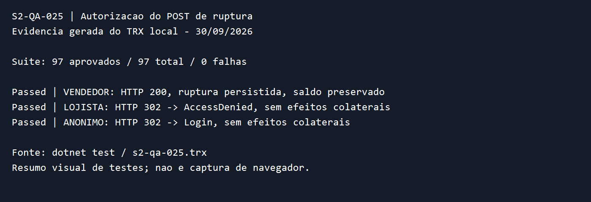

# S2-QA-025 — Autorização do registro de ruptura

Validação local em 30/09/2026. Branch `test/s2-qa-025-emmy`, criada a partir
de `dev/emmy` no commit `5db341a`, dependente do PR #39 (S2-QA-024).
O PR desta entrega tem como base `dev/emmy`. A `main` não foi alterada.

## Requisitos e escopo

RF-16 e RF-18 do SRS atribuem o resultado do atendimento ao vendedor;
RN-05 e RN-06 exigem declaração explícita e SKU. O contrato operacional
vigente restringe `EstoqueController` a VENDEDOR. LOJISTA recebe acesso
negado; anônimo é encaminhado ao login. Nenhuma política ou código de
produção foi alterado. Dependências: endpoint implementado, autenticação
por cookies e factory de integração com SQLite relacional em memória.

## Cobertura HTTP

`RupturaHttpTests` executa cada cenário com banco isolado, cookies reais,
redirecionamento automático desabilitado e token antiforgery da identidade
atual. Todos enviam `POST /Estoque/RegistrarNaoTinha` para SKU válido.

| Contexto | Resposta exigida | Persistência verificada |
| --- | --- | --- |
| VENDEDOR autenticado | 200; JSON com mensagem de sucesso e SKU correto | Uma ruptura com SKU, vendedor, ID e data; saldo preservado; nenhuma movimentação |
| LOJISTA autenticado | 302 para `/Account/AccessDenied?ReturnUrl=%2FEstoque%2FRegistrarNaoTinha` | Todos os saldos preservados; nenhuma ruptura ou movimentação |
| Anônimo | 302 para `/Account/Login?ReturnUrl=%2FEstoque%2FRegistrarNaoTinha` | Todos os saldos preservados; nenhuma ruptura ou movimentação |

Os cenários negados conferem tabelas vazias antes e depois e recarregam todos
os saldos em novo escopo com `AsNoTracking`. O login do lojista tem resposta
verificada para evitar confundir acesso negado com sessão anônima.

## Resultados e revisão local

- `dotnet build src/SquadEstoque.Web/SquadEstoque.Web.csproj`: aprovado, zero avisos e erros.
- `dotnet test tests/SquadEstoque.Web.Tests/SquadEstoque.Web.Tests.csproj --logger "trx;LogFileName=s2-qa-025.trx"`: 97 aprovados, zero falhas e ignorados; três casos em `RupturaHttpTests`.
- `git diff --check` do escopo: aprovado. A verificação global acusa somente espaços em três relatórios preexistentes de venda, excluídos desta entrega.
- Revisão manual do diff: conferidos requisitos, POST real, identidade, token, redirecionamentos e leitura persistida; nenhum arquivo de produção modificado.
- O cartão fornecido não especifica roteiro manual adicional. Não foi executado novo fluxo em navegador; a evidência abaixo é um resumo visual do TRX real.

O TRX completo é gerado em `tests/SquadEstoque.Web.Tests/TestResults/s2-qa-025.trx`.
A imagem contém apenas resultados, sem cookies ou credenciais.
O link do PR e o resultado do GitHub Actions serão registrados no PR.
A aprovação por outro integrante permanece dependente de revisão humana.
Este relatório está pronto para registro no cartão pelo usuário; nenhuma
movimentação ou edição no Trello foi realizada.
