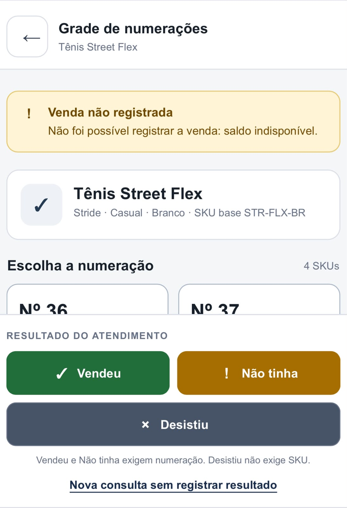

# Validação da venda rápida sem saldo — 22/09/2026

## Escopo

Branch: `dev/emmy`. Rastreabilidade: VEN-VEN-02, IT-25, RF-11, RF-17 e RN-02.
Objetivo: rejeitar a venda rápida de um SKU com saldo exatamente zero, sem saldo negativo e sem movimentação.

Teste: `VendaRapidaHttpTests.Vendedor_cannot_sell_zero_stock_and_creates_no_movement`.

O teste cria produto e SKU ativos com saldo 0 em SQLite em memória exclusivo da execução. Confere o perfil VENDEDOR e autentica pelo formulário real, com cookie e antiforgery. Envia uma única requisição `POST /Estoque/Vender`. Não há cenário concorrente nem alteração de código de produção.

## Asserções e resultado

| Verificação | Resultado |
| --- | --- |
| Pré-condição persistida | SKU ativo com saldo exatamente 0; tabela de movimentações vazia |
| Autenticação | Login real de VENDEDOR com redirecionamento para `/Estoque/Consulta` |
| Resposta de venda | HTTP 400 Bad Request; conteúdo `application/json` |
| Campo `mensagem` | `Saldo insuficiente para saída. Saldo disponível: 0 par(es).` |
| Saldo após rejeição | Permanece exatamente 0, consultado em novo contexto, sem rastreamento |
| Demais SKUs | Conjunto de IDs e snapshots permanecem iguais |
| Movimentações | Tabela inteira continua vazia |

## Execução local

Windows, .NET 10; executado em 22/09/2026.

```powershell
dotnet build src/SquadEstoque.Web/SquadEstoque.Web.csproj
# Aprovado: 0 avisos e 0 erros.

dotnet test tests/SquadEstoque.Web.Tests/SquadEstoque.Web.Tests.csproj --logger "trx;LogFileName=suite-venda-sem-saldo.trx"
# Aprovados: 83; falhas: 0; ignorados: 0.
```

O TRX está em `tests/SquadEstoque.Web.Tests/TestResults/suite-venda-sem-saldo.trx` (artefato local ignorado pelo Git). O novo teste passou na primeira execução. A revisão local do diff confirmou que a resposta de erro é causada pelo saldo zero de SKU válido, e que o estado persistido é conferido em outro contexto.

`git diff --check` apontou somente linha vazia excedente em evidência local preexistente da atividade com saldo disponível. Esse arquivo foi preservado e não faz parte deste commit. A verificação dos arquivos deste cartão não apresenta erros.

## Validação manual no Azure

Ambiente: [aplicação informada](https://asp-squad-estoque-free-hgabd8asd5f4a9g9.northcentralus-01.azurewebsites.net/Account/Login).

Login realizado com `vendedor@squad.com` em minúsculas. A busca por `Tênis` retornou `Tênis run`, marca Olympics, cor Preto. A grade mostrou tamanho 37, saldo 0, `INDISPONÍVEL`. A interface publicada não apresentou botão de venda ou resultado do atendimento, impedindo executar a tentativa de venda manual nesta sessão. Nenhuma alteração foi feita no banco compartilhado. A rejeição HTTP, o saldo persistido e a ausência de movimentação são comprovados pelo teste de integração isolado.

## Foto fornecida pelo solicitante



A foto mostra a grade do Tênis Street Flex, SKU base STR-FLX-BR, o aviso **Venda não registrada** e a mensagem **Não foi possível registrar a venda: saldo indisponível.** Também mostra as ações Vendeu, Não tinha e Desistiu.

Esta captura foi fornecida pelo solicitante, não produzida pela validação manual acima. Ela documenta a mensagem visual do fluxo, mas não mostra o saldo antes/depois, o HTTP ou a tabela de movimentações. A mensagem visual difere do texto retornado pela API da base testada; não foi alterado o contrato existente para igualá-lo à foto.

## Entrega e pendências

A base `origin/main` (`3a19c82`) foi incorporada por fast-forward somente na `dev/emmy`. A referência local `main` foi preservada. Alterações locais anteriores foram preservadas, com cópia de segurança em stash.

O solicitante abrirá o PR vinculado ao cartão e solicitará revisão de outro integrante. Revisão externa, registro do link do PR no cartão e homologação manual completa permanecem pendentes. O resultado do GitHub Actions deve ser conferido para o commit enviado; aprovação local não substitui CI ou revisão externa.
